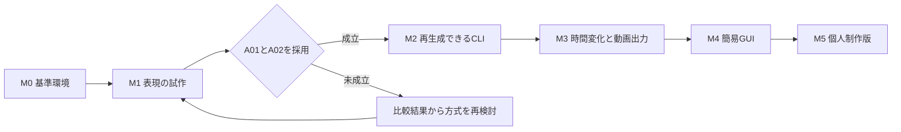

# 動画アートツールの実装ロードマップ

作成日：2026-09-13。状態：実装計画 v1.1。進捗更新日：2026-09-13。
対象：Windows限定、個人利用、RealESRGANの一つのモデルから開始する。
根拠：[要件定義書 v1.1](art-tool-requirements.md)、[AudioSR改造の対応表](art-tool-audiosr-reference.md)。
この計画の作成時点でsubmoduleは未初期化であり、モデル内部の変更方式と処理性能は未検証である。

全体進捗：**0 / 23件完了（0%）**。チェックは各タスクの完了条件を満たした時点で付ける。
更新手順は「9. 進捗と見積りの管理」に従う。

| 段階 | 対象タスク | 完了数 | 進捗率 |
|---|---|---|---|
| M0 | R01〜R04 | 0 / 4 | 0% |
| M1 | R05〜R10 | 0 / 6 | 0% |
| M2 | R11〜R13 | 0 / 3 | 0% |
| M3 | R14〜R17 | 0 / 4 | 0% |
| M4 | R18〜R20 | 0 / 3 | 0% |
| M5 | R21〜R23 | 0 / 3 | 0% |

## 1. 到達点と実装順序

最初に、モデルの改変で採用できる映像が得られるかを確認する。
その後、同じ結果へ戻れる処理基盤と動画出力を整え、短区間を比較するGUIを実装する。
試作段階からseedと実効設定を記録し、面白い結果が出ても再現できない状態を避ける。

| 段階 | 到達点 | 次へ進む条件 |
|---|---|---|
| M0 | 通常処理の基準映像と測定環境がそろう | 同条件の再実行と無改変の基準を記録できる |
| M1 | 重み変異と内部干渉の比較映像を作れる | 重み変異が動作し、A01とA02の採用レシピを制作者が選ぶ |
| M2 | CLIでレシピ保存と再生成ができる | A03、A04、A06、A10を満たす |
| M3 | 時間変化を含む短区間と本番を書き出せる | A05、A07、A08を満たし、A09の計測を行う |
| M4 | 簡易GUIで比較、調整、保存、書出しができる | F01〜F09の制作フローが一通り通る |
| M5 | 個人制作で継続利用できるWindows版になる | A01〜A10を最終構成で確認する |

## 2. M0 基準環境と試作の記録

- [ ] R01：固定版submoduleを取得し、Windows x64で現行CLIをビルドする。
  - 依存：なし。完了条件と証拠：通常動画を処理でき、ビルド手順と依存版を保存する。
- [ ] R02：同梱モデル一つの構造、重み形式、挿入可能な層、GPU処理境界を調べる。
  - 依存：R01。完了条件と証拠：対応表を作り、重み変異と中間特徴操作の可否を別々に説明できる。
- [ ] R03：比較素材、通常処理、エンコード前フレームの比較手段を用意する。
  - 依存：R01。完了条件と証拠：人物、模様、動く物体の短区間について入力と基準結果を識別できる。
- [ ] R04：試作CLI入口と最小実行記録を設ける。
  - 依存：R02、R03。完了条件と証拠：seed、方式、対象層、実効値、入力とモデルのハッシュ、環境を保存できる。

R01は[既存Windowsビルド手順](book/src/building/windows.md)を起点とし、依存版を無条件に更新しない。
MSVC実行前に同じPowerShellプロセスで`PROCESSOR_ARCHITECTURE=AMD64`と`PreferredToolArchitecture=x64`を設定する。
MSBuildのプロパティ照会で`PreferredToolArchitecture=x64`、`VCToolArchitecture=Native64Bit`を確認してからビルドする。
既存ファイルを変更する前に作業ツリーを確認し、ユーザーの変更を保持する。

R02ではロード前の数値変異とロード後の変更を比較し、重みの符号化、演算融合、GPU転送後の変更反映を確認する。
R03では初回ロードと再利用時の処理時間、ピークGPUメモリ、実効タイルサイズ、精度、TTAを記録する。
比較用の単純ぼかしは、本番機能への採用と切り離して用意する。

## 3. M1 表現を成立させる試作

- [ ] R05：推論入力へのノイズを追加する。
  - 依存：R04。完了条件と証拠：強度0で通常処理と一致し、同じseedで同じノイズ場になる。E02の比較を保存する。
- [ ] R06：元モデルから重みの乱数加算または減衰を生成する。
  - 依存：R04。完了条件と証拠：対応層で推論でき、強度を戻すと同じ重みへ戻る。配布モデルのハッシュを保つ。
- [ ] R07：中間特徴のノイズ、減衰、maskを小さく試す。
  - 依存：R02、R04。完了条件と証拠：E01の比較、または対応できない具体的理由を記録する。
- [ ] R08：固定乱数と補間による緩やかな変化を試す。
  - 依存：R05またはR07。完了条件と証拠：E03の比較と更新コストを記録し、変調対象を選ぶ。
- [ ] R09：再入力と原像保持量を比較する。
  - 依存：R05、R06。完了条件と証拠：E04とE05を比較し、形状、処理時間、末尾フレームを確認する。
- [ ] R10：同一素材の比較を制作者と評価する。
  - 依存：R05〜R09の結果。完了条件と証拠：A01とA02の採用レシピ、採用する候補、見送る候補と理由を記録する。

R07とR09は検証候補であり、全方式を製品機能へ昇格させる必要はない。
R08の補間対象を重み、中間特徴、入力ノイズのどれにするかは、見た目と測定結果で決める。
R06が未成立なら、入力ノイズや後加工だけで重み変異の実装を完了扱いにしない。

各比較は元映像、通常処理、単純ぼかし、候補処理を同じ時刻と表示寸法で並べる。
固定seedで低強度、中強度、高強度を試し、意図した変化と単なる白飛びや黒つぶれを区別する。
R09の再入力では各passの寸法を固定し、倍率の累積を防ぐ。
原像保持量は0で処理結果、1で寸法と色表現をそろえた元フレームとなることを確認する。

M1で不気味なぼやけが成立しなければ、試した層、方式、強度と映像を残して再検討する。
モデル変更や拡散方式の導入が必要になった場合は要件変更として制作者が判断する。
DDIM stepsやCFGを現行RealESRGANへ同名設定として追加することを代替案にしない。

## 4. M2 再生成できる処理基盤

- [ ] R11：採用方式を共通の処理設定とCLIへ統合する。
  - 依存：R10。完了条件と証拠：入力と重みの強度を独立操作でき、未対応モデルや値を開始前に検出する。
- [ ] R12：用途別RNGと実行単位の状態管理を実装する。
  - 依存：R11。完了条件と証拠：入力、重み、特徴、変調、passの乱数消費が独立し、A06とA10を満たす。
- [ ] R13：バージョン付きレシピと動画に対応する実行JSONを実装する。
  - 依存：R11、R12。完了条件と証拠：F07、A04を満たす。抽選後の値と実効タイル条件を復元できる。

R04の最小記録をR13へ移行し、M1で選んだレシピの意味が変わらないことを確認する。
同じ入力をA→B→Aの設定順で処理し、再起動、取消、例外の後もAを再生成する。
GPUに転送した変異や中間特徴の変更機構を含め、キャッシュの状態が別実行へ残らないようにする。
共有モデルの取得と推論を一つの実行管理下に置き、GUIとCLIに別々の乱数実装を持たせない。

再現性はエンコード前フレームで比較する。
同じ環境でも一致しない場合は、原因と差分を示して許容誤差を合意するまでA04を未完了とする。

## 5. M3 時間変化と本番動画

- [ ] R14：元動画の時刻と座標に基づく区間処理を実装する。
  - 依存：R12、R13。完了条件と証拠：F01、A05を満たし、途中から開始しても同じ時刻の結果が変わらない。
- [ ] R15：固定と緩やかな時間変化を本処理へ統合する。
  - 依存：R08、R14。完了条件と証拠：変化幅、周期、位相と作用先を保存し、プレビューと本番が一致する。
- [ ] R16：等倍と拡大、時刻、色変換、音声を含む出力契約を実装する。
  - 依存：R11、R14。完了条件と証拠：A07を満たし、短い末尾と可変フレームレートでも欠落を検出できる。
- [ ] R17：進捗、取消、失敗記録と処理時間の測定を整える。
  - 依存：R15、R16。完了条件と証拠：A08、A10を確認し、A09の実測から許容待ち時間を決める。

区間指定は元動画のタイムスタンプで定義し、エンコード時の時刻の付け直しと分離する。
プレビューの表示縮小と推論解像度を分け、最終確認は本番のタイル条件と解像度で行う。
再入力を採用した場合はpass単位の設定を保存し、全対象フレームに同じ処理順を適用する。
音声をコピーできない切出し位置やコンテナ条件では、再エンコード方針を明示して同期を確認する。
取消では未完了の出力を成功扱いにせず、次の要求が処理できる状態へ戻す。

## 6. M4 簡易GUI

- [ ] R18：新しい簡易GUIと既存Qt GUI拡張の配置先を決める。
  - 依存：R10、R17。完了条件と証拠：個人利用、同期再生、Windows起動、待ち時間の条件で比較し、選定理由を残す。
- [ ] R19：読込、区間選択、作用先別パラメータ、seed、プレビューを接続する。
  - 依存：R18。完了条件と証拠：F01〜F06、F09を満たし、未対応の操作を有効表示しない。
- [ ] R20：レシピ保存、読込、本番書出し、進捗と取消を接続する。
  - 依存：R19。完了条件と証拠：F07とF08を満たし、古い要求の完了通知が新しい結果を上書きしない。

GUIはR11の共通設定とR17の実行状態を利用し、推論ロジックを複製しない。
R19では元映像と結果を同じ元時刻で比較し、変更値と最後に生成した結果の設定を識別できるようにする。
設定のランダム化を追加採用する場合は生成と別操作にし、変更対象と固定対象を示す。
既存Qt GUIは別リポジトリのため、R18で選ぶまでは具体的なGUIファイルパスを確定しない。

## 7. M5 個人制作版の仕上げ

- [ ] R21：最終構成でA01〜A10を再確認し、採用した映像、レシピ、測定結果を対応づける。依存：R20。
- [ ] R22：対応Windows、GPU、ドライバ、依存DLL、モデル配置と起動手順を記録する。依存：R21。
- [ ] R23：新規起動から「短区間を調整→保存→再起動→再生成→本番書出し」を通して確認する。依存：R22。

検証素材には短区間、短い末尾、長めの本番区間、音声あり、可変フレームレートを含める。
不正レシピ、モデル欠落、メモリ不足、取消を確認し、元動画と元モデルのハッシュが変わらないことを確かめる。
計測にはモデル読込、前処理、推論、出力変換、エンコードを分け、初回と再利用時を別に残す。
M3以降の変更で表現が変わった場合は、M1で選んだレシピも再評価する。

## 8. 主な改修箇所

以下は現行コード上の起点であり、新しいモジュール名やAPIは各段階で設計する。

| 現行の起点 | 担当する変更 |
|---|---|
| [filter_realesrgan.cpp](../src/filter_realesrgan.cpp)と外部推論ライブラリ | R02、R05〜R08、R11の入力処理、重みと特徴への介入 |
| [processor.h](../include/libvideo2x/processor.h)、[processor_factory.cpp](../src/processor_factory.cpp) | R11の共通設定と処理選択 |
| [argparse.cpp](../tools/video2x/src/argparse.cpp)、[video2x.cpp](../tools/video2x/src/video2x.cpp) | R04、R11、R13のCLI入口 |
| [libvideo2x.cpp](../src/libvideo2x.cpp)、[conversions.cpp](../src/conversions.cpp) | R14〜R17の時刻、寸法、変換、処理状態 |
| [decoder.cpp](../src/decoder.cpp)、[encoder.cpp](../src/encoder.cpp) | R16の区間入出力と同期。既存処理を調べ、必要な変更だけ加える |
| [CMakeLists.txt](../CMakeLists.txt) | R01のビルド確認と採用した新規モジュールの組込み |

新規ファイルは200行以下とし、入力処理、モデル操作、実行記録の責務で分割する。
既存の長いファイルは今回の変更に必要な範囲で扱い、無関係な全面分割を作業に含めない。
コミットする場合はユーザー規則に従ってファイルごとに分け、段階の完了判定は関連変更を統合した状態で行う。

## 9. 進捗と見積りの管理

R01〜R23のチェックリストを進捗管理の正本とする。
初期状態は全件未着手とし、以後は各作業で更新した状態を引き継ぐ。

- 作業開始時に対象IDと依存タスクを確認し、対象項目の下に「状態：実装中」などを記録する。
- 実装、調査、評価を終え、記載された完了条件と必要な検証を満たしたら、実装担当者は同じ作業内で対象の `- [ ]` を `- [x]` に更新する。完了報告より先に反映し、後回しにしない。
- 完了時は対象項目の下に、完了日、変更箇所、検証コマンドまたは確認方法、結果の保存先、未解決事項を記録する。長いログは保存先へリンクする。
- 部分実装、未検証、受入待ち、保留は未チェックのまま、状態と残作業を記録する。実装済みと受入済みは区別し、制作者の判断が完了条件に含まれる項目は、その判断後にチェックする。
- チェック更新と同時に、冒頭の全体進捗、段階別の完了数と進捗率、進捗更新日を更新する。進捗率は完了件数 ÷ 対象件数 × 100（小数第1位に四捨五入）とし、工数の消化率とは分ける。
- 不具合や要件変更で完了条件を満たさなくなった場合はチェックを外し、理由と残作業を記録して集計も戻す。

段階の完了は、対象タスクすべてのチェックと「次へ進む条件」の両方で判定する。
表現の採否は制作者が、コードと再現性の検証は実装担当者が判断する。

固定日程は、重み形式と内部介入の可否が分かるR02完了後にM1の工数を見積もり、R10後にM2以降を見積もって設定する。
GPU時間と実装工数を別々に記録し、未測定の速度を前提にGUIの即時応答を約束しない。
最初に着手する範囲はR01〜R04とし、その成果物を使ってR05とR06の比較を始める。
